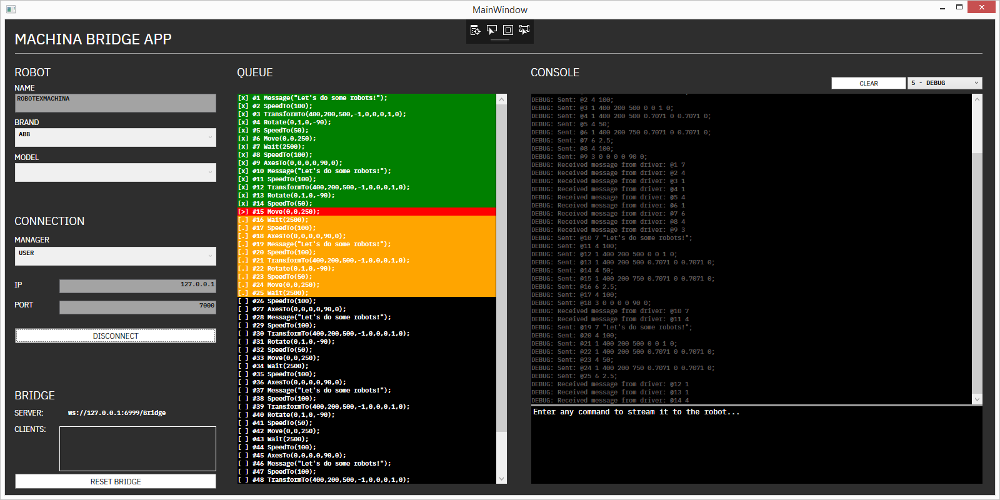

# Machina Bridge

A Machina-powered Windows application that allows online connections to industrial robotic arms, real-time streaming of actions via a command-line interface, queue management, and interfacing with other applications via a websockets server.

## Tutorials

A full set of tutorials on how to use the Machina framework can be found here:

Tutorials playlist: https://www.youtube.com/playlist?list=PLvxxYImPCApXj3tHVKmpTS_AuMPngnA47

Instructions on how to setup your machine to work with the Machina framework can be found here: https://www.youtube.com/playlist?list=PLvxxYImPCApUffcv_KtdR-sQydA4O4CPH.

## Projects

A playlist of projects built by the community with different Machina flavors:
https://www.youtube.com/playlist?list=PLvxxYImPCApXZ-yBCUtGzVWb2ZhduaSXR

🤖x❤️